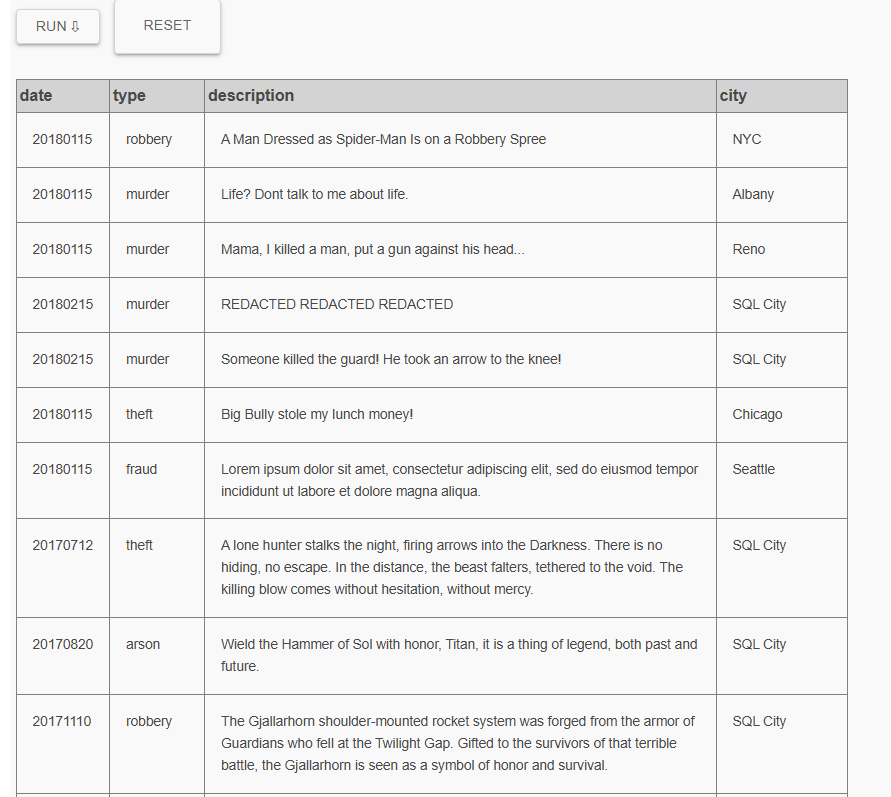
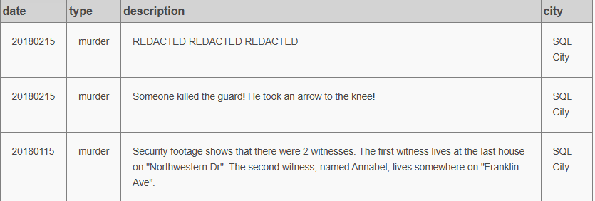
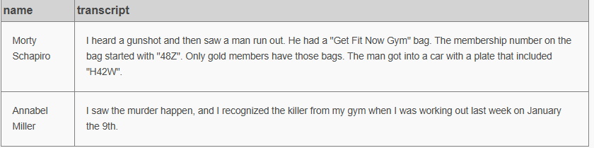
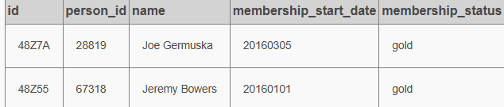
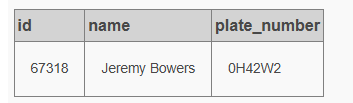

# SQL Murder Mystery: Investigación del Asesinato en SQL City

## Descripción del Caso

El 15 de enero de 2018, un asesinato tuvo lugar en **SQL City**. Este documento presenta la investigación forense de datos realizada mediante consultas SQL para identificar al responsable del crimen, siguiendo las pistas proporcionadas por testigos y cruzando información de múltiples bases de datos.

---

## Proceso de Investigación

### Fase 1: Reporte Inicial del Crimen

La investigación comenzó examinando todos los reportes de crímenes disponibles en la base de datos para contextualizar el caso.

*Resultado inicial: Múltiples reportes en diferentes ciudades*

*Imagen 1: Resultados de la primera consulta exploratoria*

---

### Fase 2: Filtrado del Crimen Específico

Para acotar la búsqueda, se filtraron los resultados para mostrar únicamente el crimen ocurrido en SQL City y de tipo asesinato.

**Hallazgo importante:** El reporte menciona dos testigos clave:
- El primer testigo vive en la última casa de *Northwestern Dr*
- El segundo testigo se llama *Annabel* y vive en *Franklin Ave*

*Imagen 2: Reporte detallado del asesinato en SQL City*

---

### Fase 3: Localización de los Testigos

Con la información del reporte, se procedió a buscar a los testigos en la tabla de personas, utilizando sus direcciones y nombres como referencia.

**Testigos identificados:**

| ID    | Nombre          | Dirección       |
|-------|-----------------|-----------------|
| 14887 | Morty Schapiro  | Northwestern Dr |
| 16371 | Annabel Miller  | Franklin Ave    |

*Imagen 3: Datos de los testigos en la base de datos*

---

### Fase 4: Interrogatorio a los Testigos

Una vez identificados, se procedió a interrogar a los testigos consultando sus declaraciones en la tabla de entrevistas.

**Declaraciones obtenidas:**

> **Morty Schapiro:** "Ví al asesino. Era un hombre con una bolsa del gimnasio 'Get Fit Now Gym'. El número de socio empezaba por '48Z'. Solo los socios gold tienen esas bolsas. El hombre entró en un coche con una matrícula que incluía 'H42W'."

> **Annabel Miller:** "Reconocí al asesino del gimnasio cuando volví a entrenar el 9 de enero."

*Imagen 4: Transcripciones completas de los testimonios*

---

### Fase 5: Búsqueda de Socios del Gimnasio

Aplicando la primera pista de Morty, se buscaron en el gimnasio los socios con membresía gold cuyo ID comenzara con "48Z".

**Sospechosos potenciales:**

| ID     | Person_id | Nombre        | Status |
|--------|-----------|---------------|--------|
| 48Z7A  | 28819     | Joe Germuska  | gold   |
| 48Z55  | 67318     | Jeremy Bowers | gold   |

*Imagen 5: Listado de socios gold con membresías 48Z*

---

### Fase 6: Cruce con Datos de Vehículos

Para reducir la lista de sospechosos, se cruzaron sus datos con la tabla de licencias de conducir, buscando la matrícula que contenía "H42W".

**Resultado concluyente:**

| ID    | Nombre        | Matrícula |
|-------|---------------|-----------|
| 67318 | Jeremy Bowers | H42W0X    |

*Imagen 6: Confirmación de la matrícula del vehículo*

---

### Fase 7: Verificación de la Coartada

Para confirmar la declaración de Annabel, se verificó si Jeremy Bowers estuvo en el gimnasio el 9 de enero de 2018.

**Confirmación:**

| Membership_id | Check_in_date | Check_in_time | Check_out_time | Nombre        |
|---------------|---------------|---------------|----------------|---------------|
| 48Z55         | 20180109      | 1530          | 1700           | Jeremy Bowers |

*Nota: No se incluye imagen para esta fase por límite de evidencias.*

---

### Fase 8: Confirmación Final del Asesino

Con todas las evidencias reunidas, se procedió a verificar la solución en el sistema.

**Resultado del sistema:**

*Nota: No se incluye imagen para esta fase por límite de evidencias.*

---

## Resumen de Evidencias

| Evidencia          | Fuente                  | Descripción                                |
|--------------------|-------------------------|--------------------------------------------|
| Testimonio Morty   | Tabla interview         | Socio gold con ID 48Z y matrícula H42W     |
| Testimonio Annabel | Tabla interview         | Vio al sospechoso el 9/01/2018             |
| Membresía          | Tabla get_fit_now_member | Jeremy Bowers: ID 48Z55 (gold)           |
| Vehículo           | Tabla drivers_license   | Matrícula H42W0X                           |
| Registro gimnasio  | Tabla get_fit_now_check_in | Check-in: 09/01/2018 15:30               |

---

## Conclusión

Mediante un análisis sistemático de las bases de datos y la aplicación de consultas SQL progresivas, se ha determinado que:

**El asesino es: JEREMY BOWERS**

Las evidencias recolectadas (testimonios, membresía del gimnasio, matrícula del vehículo y registro de entrada) coinciden perfectamente, dejando cero dudas sobre su culpabilidad.

---

## Fuente del ejercicio

[SQL Murder Mystery](https://mystery.knightlab.com/)